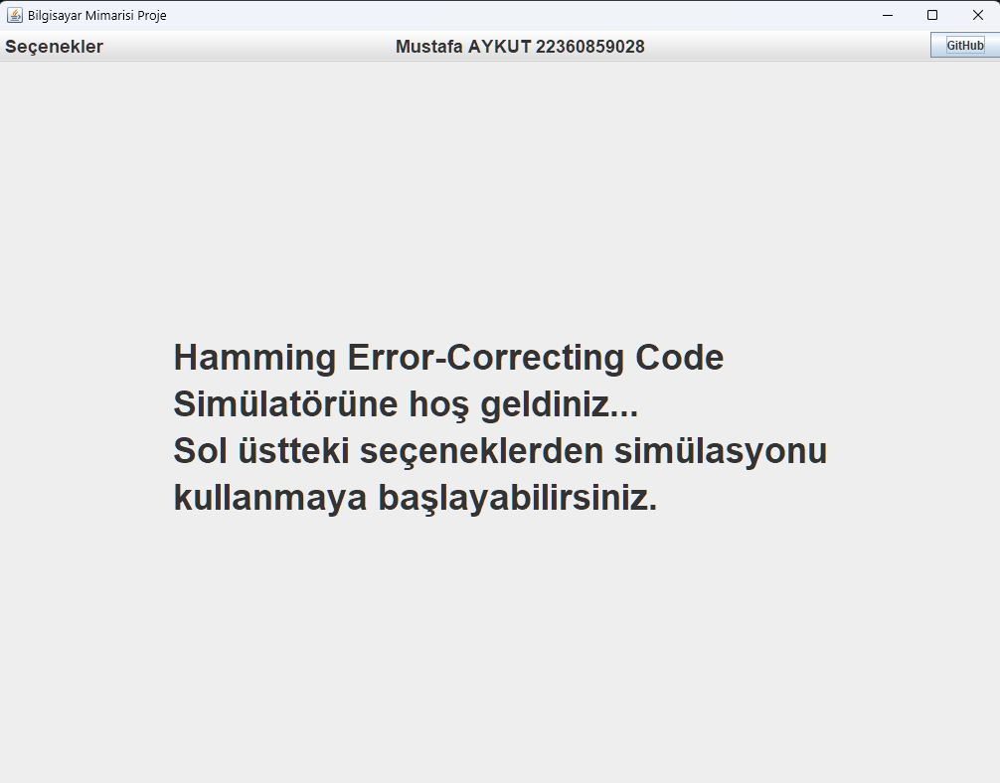
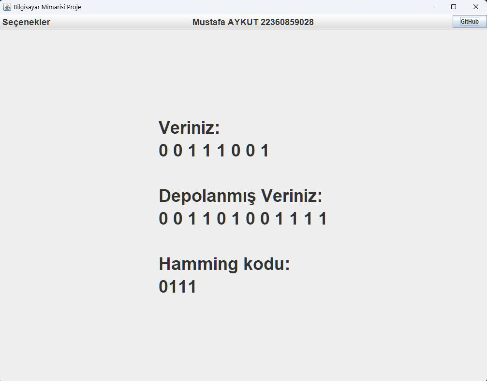
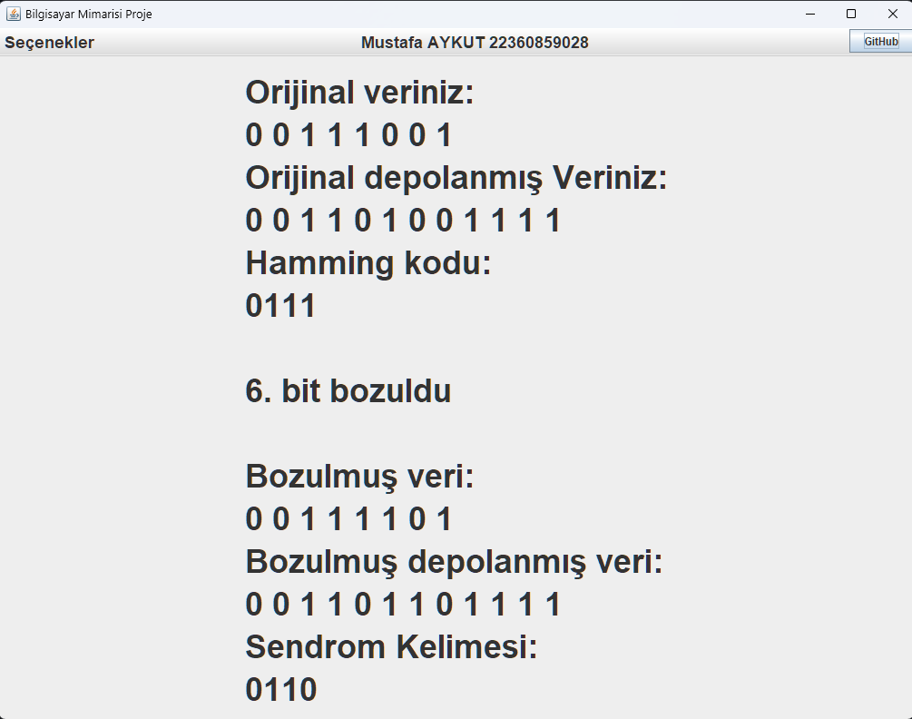

# Bilgisayar Mimarisi Hamming Error-Correcting Code Simülatörü

## Oynanış Videosu
[Oynanış Videosu](https://youtu.be/SIEGoBo7YGc)

## Projenin Amacı

* Kullanıcıya sunulan 4,8 veya 16 bitlik verilerden birinin seçilip istenilen bir binary değerin girilmesi ve bu girilen verininin check bitleri ile depolanmış veriye dönüştürülmesi. Ardından kullanıcının istediği konumdaki bitin değerinin değiştirilip hatalı bir veri elde edilip bu hatalı verinin ve sendrom kelimesinin ekrana yazdırılmasıdır.

## Simülasyon Nasıl İndirilir?
* Projenin GitHub sayfasındaki BilgisayarMimarisiProje.jar dosyası indirilip çift tıklayarak ya da projenin kaynak dosyalarının bulunduğu BilgisayarMimarisiProje01.zip dosyası indirelerek Java IDE'si üzerinden çalıştırılabilir.

## Simülasyon Nasıl Kullanılır?
* BilgisayarMimarisiProje.jar dosyasına çift tıklandıktan sonra açılan pencerede sol üstteki seçenekler kısmından gerekli işlem seçilir. Veri Ekleme tuşu ile istenilen bit sayısında veri girilir. Girilen verinin bozulması isteniyorsa yine aynı şekilde sol üstteki seçenekler kısmına gidilir. Veri Bozma tuşu ile istenilen konumdaki bitin değeri değiştirilir.
  
## Projeden Bazı Görseller
### Ana sayfa
### 
### Veri Ekleme
### 
### Veri Bozma
### 

## Projeyi Yapan
Mustafa AYKUT

